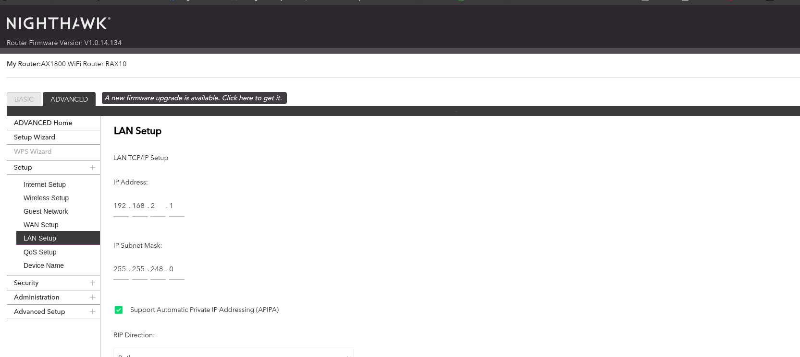

# Homelab Setup


I live in an apartment where the WiFi is managed by the building. To set up my own homelab, I needed a personal router that connects to the apartment’s WiFi and serves as a gateway for my devices. 

Since I have no control over the apartment's IP range (`172.16.0.0/12`), I configured my router to use a different subnet. I chose `192.168.0.0/16` with a subnet mask of `255.255.248.0`, which provides an IP range of `192.168.0.0 - 192.168.7.255`.



I initially considered a `255.255.0.0` subnet, but it was too large and conflicted with the default VM network range. Changing the VM network range previously required resetting my servers, so I opted for this subnet to avoid that hassle.


### Network Topology

- My office has an Ethernet wall port, which I connect to a **Netgear Nighthawk router**.
- Two **Linksys unmanaged switches** connect to the router.
- All homelab devices are wired to these switches, and they also have WiFi access.
- To manage the router, I use [routerlogin.net](https://routerlogin.net/).

### Devices

| Device               | OS           |
|----------------------|-------------|
| **Laptop** (Lenovo ThinkPad) | Fedora 41  |
| **Old ThinkPad** (Thick Model) | RHEL 9.5   |
| **Supermicro Server** | RHEL 9.5   |
| **Dell PowerEdge Server** | AlmaLinux 9.5 |

---

## Router Configuration

For a stable setup, static IP addresses are assigned to all servers via the router’s admin panel. This ensures consistent networking, making it easier to manage services and access devices.

---

## Setting Up VMs with SSH Keys

To avoid using passwords for SSH and Ansible automation, I configure SSH key authentication.

### Removing Old SSH Keys:
```bash
ssh-keygen -R 192.168.2.5
ssh-keygen -R 192.168.2.6
ssh-keygen -R 192.168.2.7
```

### Adding New SSH Keys:
```bash
ssh-copy-id jwhiteaker@192.168.2.5
ssh-copy-id jwhiteaker@192.168.2.6
ssh-copy-id jwhiteaker@192.168.2.7
```

---

## Essential Services Hosting

The **old ThinkPad running RHEL 9.5** serves as the primary node for essential services due to its lower power consumption and noise levels. This allows me to **power down the Dell PowerEdge and Supermicro servers** when not needed.

### Hosted Services:
- **Cockpit** (on all servers)
- **FreeIPA** (for DNS and authentication)
- **Pi-hole** (for network-wide ad blocking)
- **K3s Server Node** (for Kubernetes workloads)

---

## Homelab Architecture

To visualize my setup, here’s a **Mermaid diagram** representing the homelab infrastructure:


---

## Future Plans

- **Automating cluster deployments** using ArgoCD & Ansible
- **Expanding Kubernetes workloads** with additional nodes
- **Enhancing network security** with better firewall rules and VLANs

This homelab allows me to **test, break, and experiment with new technologies** in a controlled environment while maintaining a stable setup for essential services.