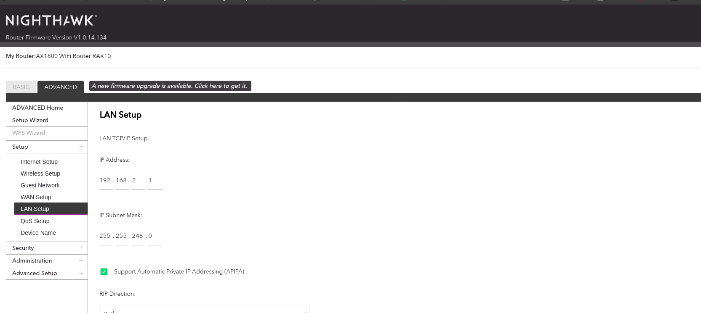
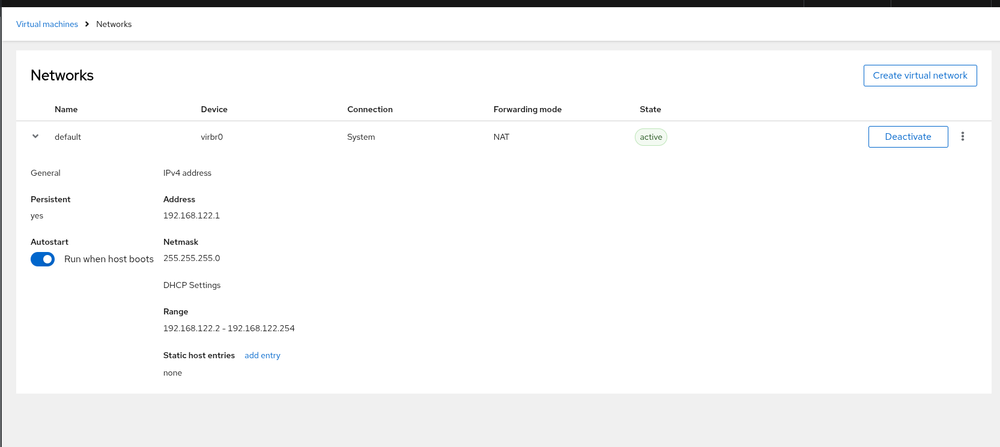
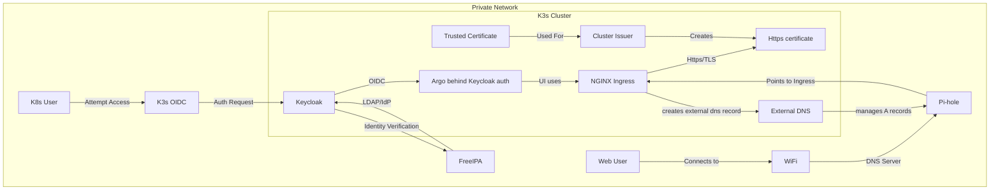

# Setup

live at an apartment that provides wifi and they manage it. So, in order for me to setup my own homelab, I need a wifi router to connect to the apartment's wifi and then connect my devices to the router. So my apartments wifi ip range is 172.16.0.0/12. and with me not knowing or having any control over that, I need to setup my router to have a different ip range. I chose 192.168.0.0/16 as my ip range for my homelab with the subnet mask being 255.255.248.0 which gives us 0.0.7.255.



so our ip range is 192.168.0.0 - 192.168.7.255

the reason I this range is because when I had the subnet mask as 255.255.0.0 , it was too big and interfered with the default vm network ip range. I would change the default vm network ip range but last time I did that, I had to completely reset my servers. So just to make it easier for now, I will use this range.



so I have an ethernet wall plug in my office room. I connect my own netgear nighthawk router to that wall plug. I have two linkseys unmanaged switches that connect to the router. I then connect my all of my devices to those switches and they are now connected to the wifi. in order to access the router ui page, I simply navigate to <https://routerlogin.net/> in order to manage my netgear router.  

Now for devices on this network, theres not that many. I have a my personal laptop whcih is a one year old lenevo thinkpad (one withy the copilot button on the keys 🤢), however, I am running fedora on this device. I also have a really old and thick lenevo thinkpad that is running rhel 9.5, a supermicro server running rhel 9.5, and a dell poweredge server running almalinux 9.5.

## Router Setup

in order to make this lab stable, we need to assign static ip addresses to our servers. We can do this by going to the router's admin page and assigning static ip addresses to the servers mac addresses.

## Setting up vms with ssh key

ok so we have a few vms that we want to manage and we don't want to have to use a password every time we want to ssh into them or run an ansible playbook on them. We can use ssh keys to make this process easier.

```bash
ssh-keygen -R 192.168.2.5
ssh-keygen -R 192.168.2.6
ssh-keygen -R 192.168.2.7
```

this will remove the old ssh keys for the servers. Now we can generate new ssh keys for the servers.

```bash
ssh-copy-id jwhiteaker@192.168.2.5
ssh-copy-id jwhiteaker@192.168.2.6
ssh-copy-id jwhiteaker@192.168.2.7
```

## Hosting Essential Services

For hosting the absolute essential services for the homelab, I will be using the old thinkpad running rhel 9.5. You might be wondering why I am using the old thinkpad instead of the supermicro server. Well, the supermicro server is a bit loud and I don't want to have to listen to that all the time and it also uses a lot of power. The old thinkpad is quiet and uses less power meaning I can unplug the dell poweredge server and the supermicro server to reduce the power consumption of the homelab and reduce the noise while still being able to host the essential services.

So whats being hosted on the thinkpad?

besides every server running cockpit, I am running freeipa, pi-hole, and a k3s server node on my thinkpad. Now I am using freeipa for its dns ability and the ability to configure credentials for all of my devices and services. I am using pi-hole to block ads on my network and I am using k3s to host my own kubernetes cluster.


## Goal of the Homelab

To explain what I am wanting to setup, its probably easier to visualize it. So I will use mermaid to create a diagram of what I am wanting to setup.

